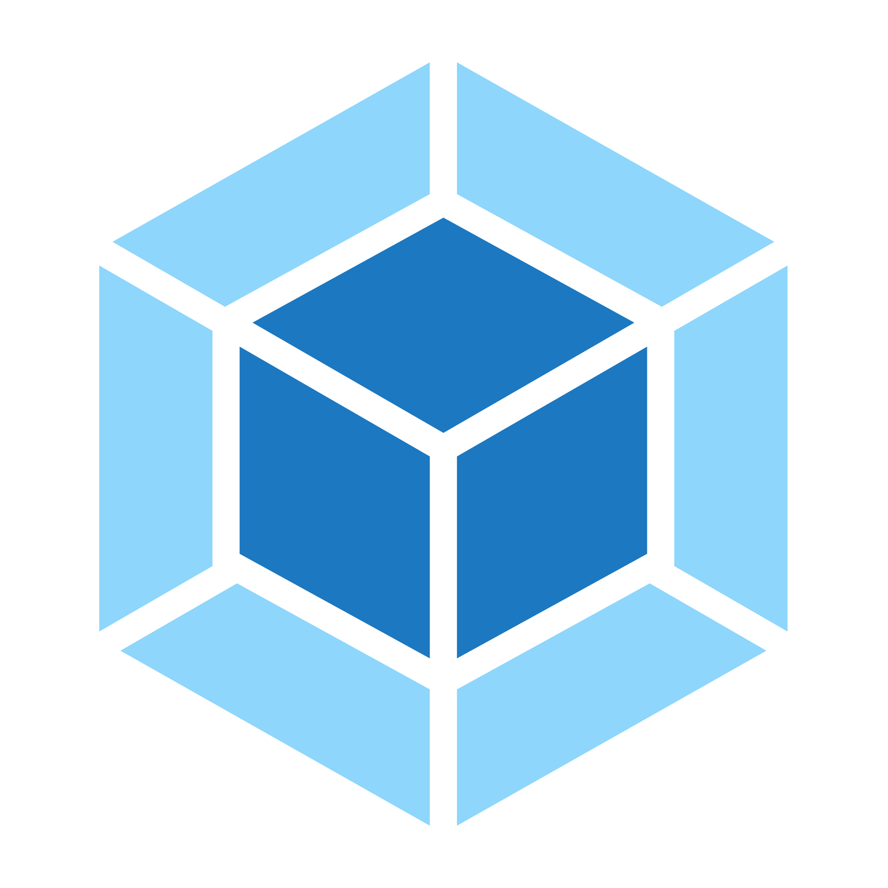

[](https://github.com/zapupenec/frontend-project-11/actions)
[](https://github.com/zapupenec/frontend-project-11/actions/workflows/mainCI.yml)
[](https://codeclimate.com/github/zapupenec/frontend-project-11/maintainability)

EN | [RU](https://github.com/zapupenec/frontend-project-11/blob/main/README-ru.md)

# [RSS reader](https://frontend-project-11-zapupenec.vercel.app)
A service for aggregating RSS feeds, with which it is convenient to read a variety of sources, such as blogs. It allows you to add an unlimited number of RSS feeds, updates them itself and adds new entries to the general feed.


<p>
  <a href="https://developer.mozilla.org/en-US/docs/Glossary/html5" target="_blank" rel="noreferrer">
    
  </a>
  <a href="https://getbootstrap.com/" target="_blank" rel="noreferrer">
    
  </a>
  <a href="https://developer.mozilla.org/en-US/docs/Web/JavaScript" target="_blank" rel="noreferrer">
    
  </a>
  <a href="https://webpack.js.org/" target="_blank" rel="noreferrer">
      
  </a>
  <a href="https://lodash.com" target="_blank" rel="noreferrer">
    
  </a>
  </a>
    <a href="https://www.i18next.com" target="_blank" rel="noreferrer">
    
  </a>
  </a>
    <a href="https://axios-http.com" target="_blank" rel="noreferrer">
    
  </a>
  </a>
    </a>
    <a href="https://github.com/jquense/yup" target="_blank" rel="noreferrer">
    
  </a>
  </a>
  </a>
    <a href="https://github.com/sindresorhus/on-change" target="_blank" rel="noreferrer">
    
  </a>
</p>

## Install for development
Developed using Node.js v20.4.0.

Clone the repository locally and install the dependencies.
```
make install
```
Start local server.
```
make develop
```
Build for development.
```
make build-dev
```
Build for production.
```
make build
```